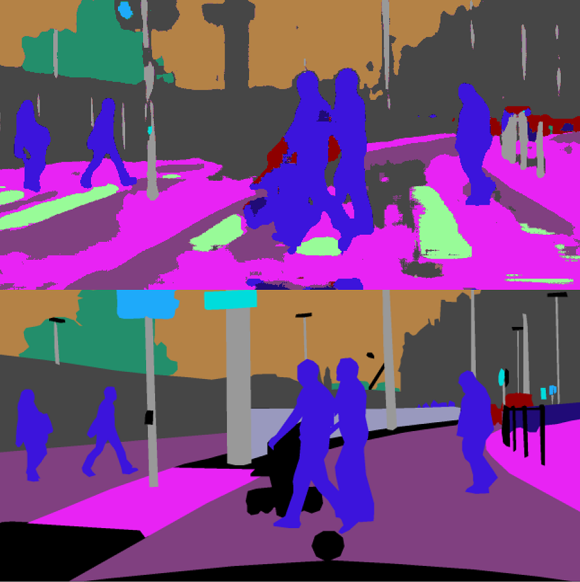

# Modalities for semantic segmentation

Using FlowNet for training a PSPNet - Boschert L, Ging S, Siemund H - 03.02.19

[Full size poster](docs/ModalitiesForSemanticSegmentation.pdf)

Prediction example:



# Base Model: PSPNet

Link to the paper and code: <https://hszhao.github.io/projects/pspnet/>

Link to code on which this project was based: <https://github.com/ykamikawa/PSPNet>.

## Package setup

```
# ----- Requirements:
# python 3.5
# Cuda 8.0.61
# tensorflow-gpu==1.8, keras==2.1.0, h5py==2.9, opencv-python, matplotlib

virtualenv --system-site-packages -p python3 venv3
source venv3/bin/activate
pip install tensorflow-gpu==1.8
pip install keras==2.1.0
pip install h5py==2.9
pip install opencv-python
pip install matplotlib
```

# Dataset Preprocessing

1. Download labels at <https://www.cityscapes-dataset.com/downloads/>

 `gtFine_trainvaltest.zip (241MB)` and extract them

1. Download the video frame sequences `leftImg8bit_sequence_trainvaltest.zip (324GB)`, do not extract

1. extract images from video dataset zip file with 
`python handle_dataset.py`

1. find and copy corresponding labels
`python handle_dataset.py --labels`

1. copy only the first frame of all images into another folder `python handle_dataset.py --singles`

## Apply FlowNet3

1. Install FlowNet3: <https://github.com/lmb-freiburg/netdef_models>

2. Apply it on the dataset and get the raw flow

3. Compress it

```
python handle_flow.py --compress
# This creates: train.csv, val.csv, test.csv
```

## Weight balancing

`python compute_class_weights.py`

## Dataset structure

the flow minimum and maximum values per axis are in the csv files

```
# default dataset folder: datasets/city_full/
# csvs for splits
test.csv
train.csv
val.csv
# computed balanced weights
weights_categories.json
weights_labels.json
# image folder (with frame 19, without any more subfolders than these)
images/test/
images/train/
images/val/
# flow folder (with compressed flows, motion bounds, occlusions)
flow/test/
flow/train/
flow/val/
# labels
labels_ids/train/
labels_ids/val/
# color coded labels folders (like labels_color) are only there for
# visualization but currently not used by the program 
```

# Training

Important flags when running `python train.py`

```
--model_name model1     # name models

--use_flow              # use additional optical flow input
--use_occ               # occlusions
--use_mb                # motion boundaries

--restart               # restarts model from epoch 0 instead of reloading

--unbal_xlast    		# disable weight balancing
--train_categories      # train on 8 categories instead of 20 classes

--use_cpu               # no gpu
--use_random            # random data input instead of dataset (to test)
```

# Testing

Use the same arguments for `python test.py` as for training (including weight balancing flags).

`--full_size` to run predictions and metrics on full size images (2048x1024)

Test results:

- `logs/model_name/pred` contains first 10 predictions and ground truths.

- `result_test/model_name` contains first 10 inputs (images, flow etc.)

# Visualization

`python plot_stuff.py --plot_from_config`

## Visualize labels

`python array_to_img.py`

Results will be stored in `result_vis/`

## Input data

- 2048x1024 RGB Images
- Flow predicted with 2 frames within 60ms distance
- Flow is saved as 2 grayscale images

## Augmentation

- random resampling (0.5 to 2.0)
- random crop to (512x512)

## Hyperparameters 

Unfortunately in the PSPNet paper they did not say much about their optimization process.

### Optimizer

We used adadelta with default values of keras: `keras.optimizers.Adadelta(lr=1.0, rho=0.95, epsilon=1e-6)`

### Model budget

We took the model source (first link in this document) baseline which was batch size 4, 10 epochs, 6000 steps. This results to 240,000 datapoints evaluated per model.

# Cityscapes Dataset

## Labels

Overview <https://www.cityscapes-dataset.com/dataset-overview/#features>

Details <https://github.com/mcordts/cityscapesScripts/blob/master/cityscapesscripts/helpers/labels.py>

- Mapping is done in utils/labels.py from 33 input classes to 20 training classes
- For trainid=19, we do not train or predict (weight zero).

## cities

We used weimar and zurich for validation and all others that have labels and have 30-frame clips for training.

## Model notes

- mean iou report per epoch is incorrect
